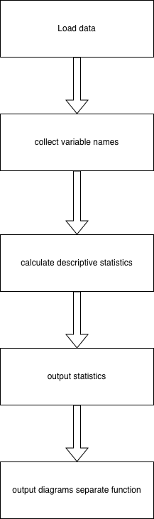

# Description of the Content
The starting point of every psychological data analysis is examining descriptive statistics of any given dataset. These datasets often contain mixed data types - numerical variables in various formats alongside open-ended survey responses stored as text strings. In psychological research, datasets typically include Likert scale responses (1-7 ratings), reaction times in milliseconds, accuracy percentages, demographic variables like age, and qualitative responses from open-ended questions.

Psychologists traditionally rely on GUI programs (like SPSS or JASP) that allow point-and-click analysis to select variables of interest. This manual process can be time-consuming and prone to human error when dealing with large datasets containing dozens of variables. This program streamlines that process by automatically generating descriptive statistics for all numerical variables in a dataset, while automatically filtering out non-numerical data types.

The tool provides essential statistical measures including mean, standard deviation, minimum and maximum values, with optional median and standard error calculations. These statistics form the foundation for understanding data distribution, identifying potential outliers, and making informed decisions about subsequent statistical analyses. This approach saves time during the initial data exploration phase and ensures consistent statistical reporting across different datasets and research projects.

# Documentation of the Problem
The input dataset is a CSV file containing 5 numerical variables and 2 string variables for demonstration purposes. The numerical variables might represent psychological constructs such as anxiety scores, depression ratings, cognitive test performance, reaction times, and demographic information like age. String variables are automatically excluded from analysis, as researchers typically examine qualitative data separately using different analytical approaches such as thematic analysis, content analysis, or qualitative coding procedures.

The mathematical calculations are straightforward: means provide central tendency measures, standard deviations indicate variability around the mean, and minimum and maximum values define the range of responses. Additional functionality includes toggleable median and standard error calculations for comprehensive descriptive analysis. The median offers a robust measure of central tendency less affected by outliers, while standard error provides information about the precision of the sample mean as an estimate of the population mean.

The design follows a modular approach with separate functions handling specific tasks, promoting code reusability and maintainability. One potential limitation involves mixed-type variables containing both strings and numbers, which can occur when numeric data is incorrectly encoded as text or when datasets contain coded missing values using text labels. This requires further testing to ensure robust error handling and appropriate data type conversion.

Error handling could be improved - the current implementation hasn't been stress-tested for edge cases that might cause crashes, such as completely empty datasets, datasets with only string variables, or files with encoding issues. Additionally, the program currently doesn't handle missing values explicitly, which are common in psychological datasets due to participant non-response or experimental errors.

In the following diagram, the sequence of the program is laid out. The diagram illustrates the data flow from CSV input through data type detection, statistical calculation, and optional visualization output. The diagram part is a separate function to keep the functionality of the original program simple. In the future, it could be a possibility to expand the core function with a graphics function that includes additional plot types such as box plots, scatter plots, or correlation matrices.

# Documentation of the Design
The program uses a functional programming approach with two main components that can be used independently or together:
- `descriptive_statistics()`: Calculates statistical measures for numerical variables and ignores non-numerical variables. This function iterates through all columns, identifies numeric data types, and computes statistics while handling potential data conversion issues.
- `create_bar_charts()`: Generates histogram visualizations for data distribution, helping researchers visually assess normality assumptions and identify potential outliers or unusual distributions that might affect subsequent analyses.

Both functions include automatic data type checking to skip non-numerical variables, ensuring statistical output only for appropriate variables.

# Documentation of the Tests
Currently, limited testing has been performed via a separate R script that processes the same dataset and compares results. This cross-validation approach helps identify potential calculation errors or implementation differences between Python and R statistical functions.

An accompanying R script can also check the output of the Python script, serving as an independent verification of the statistical calculations. In some cases, due to differences in calculation methods or floating-point precision between programming languages, small differences can still emerge.

Future testing should include:
- Mixed data type handling: Testing datasets where numeric columns contain some text values
- Wrongly labeled variables -> numerical but labeled as string: Testing automatic type conversion capabilities
- Empty dataset scenarios: Ensuring graceful handling of completely empty CSV files
- Missing value edge cases: Testing various missing value representations (NaN, empty strings, "N/A", etc.)
- Large dataset performance testing: Evaluating memory usage and processing time with datasets containing thousands of rows and columns
- Encoding issues: Testing datasets with different character encodings or special characters
- Extreme values: Testing behavior with very large or very small numbers that might cause overflow or precision issues